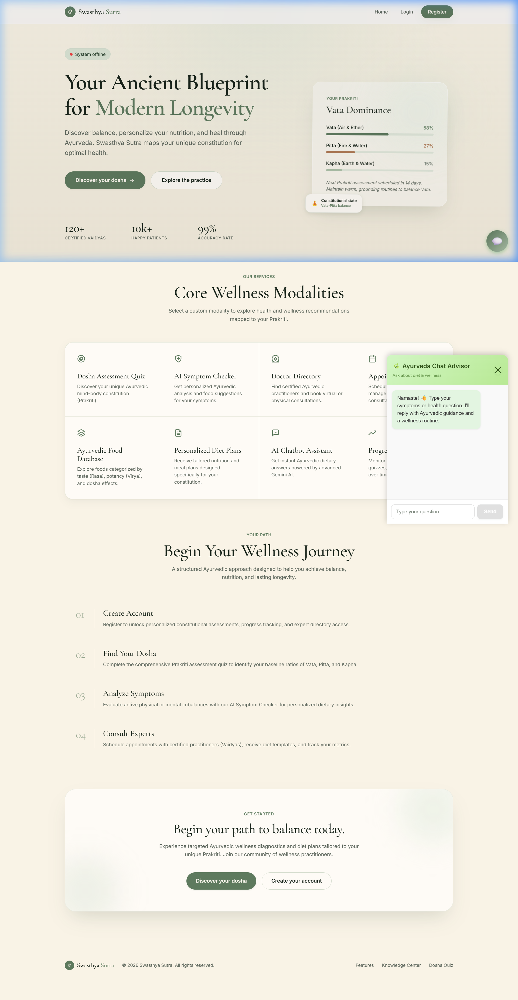
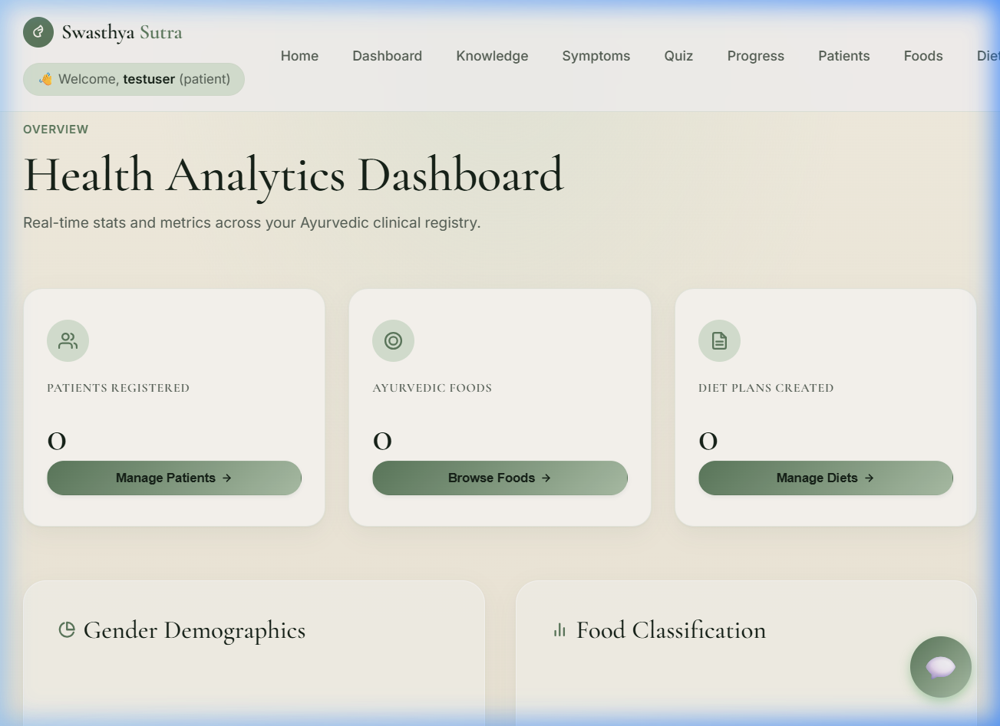
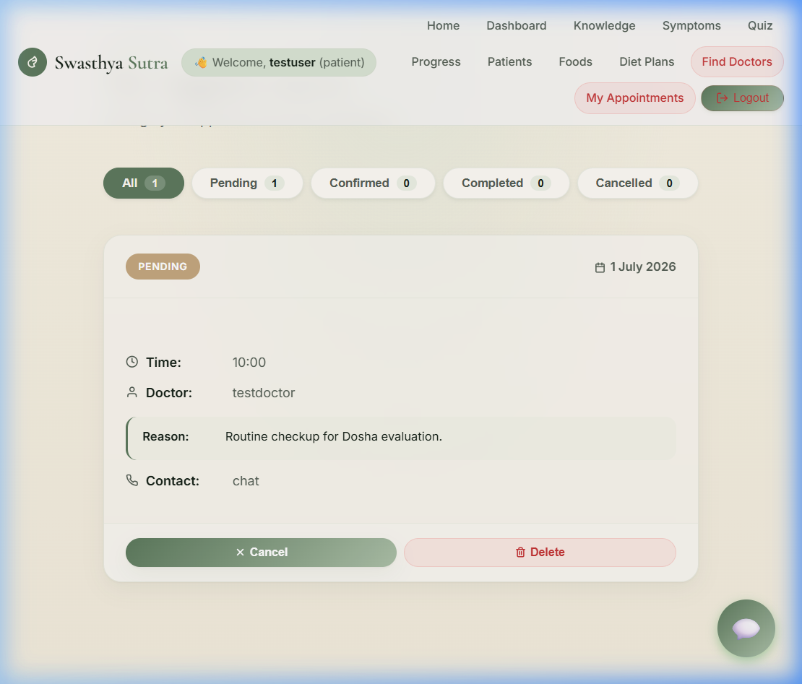
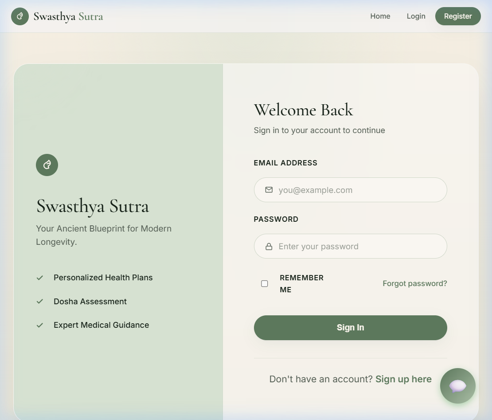

# 🌱 Swasthya Sutra (स्वास्थ्य सूत्र)
### *Your Ancient Blueprint for Modern Longevity*

<div align="center">

[](https://react.dev/)
[](https://nodejs.org/)
[](https://expressjs.com/)
[](https://www.mongodb.com/atlas)
[](https://opensource.org/licenses/MIT)

</div>

Swasthya Sutra is a premium, full-stack **MERN (MongoDB, Express, React, Node.js)** health and nutrition platform. It seamlessly merges the timeless wisdom of **Ayurvedic Medicine** (healing the mind-body constitution) with modern AI-driven lifestyle diagnostics, offering personalized dosha assessments, clinical registry analytics, and patient consultation scheduling.

---

## 📸 Project Previews

<table align="center" style="border-collapse: collapse; border: none; width: 100%;">
  <tr style="border: none;">
    <td align="center" valign="top" style="border: none; padding: 12px; width: 50%;">
      <h3>🏠 Landing Page</h3>
      <p>System status updates, Prakriti guides, and roadmap milestones.</p>
      
    </td>
    <td align="center" valign="top" style="border: none; padding: 12px; width: 50%;">
      <h3>📊 Analytics Dashboard</h3>
      <p>Demographic pie charts, classifications, and clinical registries.</p>
      
    </td>
  </tr>
  <tr style="border: none;">
    <td align="center" valign="top" style="border: none; padding: 12px; width: 50%;">
      <h3>📅 Appointments Scheduler</h3>
      <p>Status filter pills, booking, and doctor-patient details.</p>
      
    </td>
    <td align="center" valign="top" style="border: none; padding: 12px; width: 50%;">
      <h3>🔐 Secure Authentication</h3>
      <p>Glassmorphic form fields and custom role-based.</p>
      
    </td>
  </tr>
</table>

---

## ✨ Key Capabilities & Modules

### 1. 🧬 Prakriti (Dosha) Quiz
An interactive questionnaire analyzing physical traits, digestion patterns, and psychological tendencies to calculate your dominant Ayurvedic energies:
*   🌬️ **Vata (Air & Ether):** Movement, creativity, flexibility.
*   🔥 **Pitta (Fire & Water):** Metabolism, intellect, drive.
*   🌱 **Kapha (Earth & Water):** Structure, stability, calm.

### 2. 📋 Ayurvedic Diet Planner & Foods Index
A comprehensive diet formulator connecting patient diagnoses with specific dosha balancing regimens:
*   Browse food items annotated with Ayurvedic attributes.
*   Filter lists by dosha-specific health actions.
*   Generate customized clinical diet plans.

### 3. 💬 Prakriti AI Assistant
An integrated conversational chatbot trained in Ayurvedic principles. It offers virtual consultations, providing real-time feedback on dosha-balancing foods, seasonal routines (Ritucharya), and herbs.

### 4. 📅 Vaidya Appointment Scheduler
A full scheduling pipeline enabling patients to search for registered Ayurvedic practitioners, review fees/experience, book slots, and manage appointment states (Pending, Confirmed, Completed, Cancelled).

---

## 👥 Role-Based Feature Matrix

| Feature | 👤 Patient | 👨‍⚕️ Doctor (Vaidya) | 👨‍💼 Administrator |
| :--- | :---: | :---: | :---: |
| **Prakriti Dosha Quiz** | ✅ | ✅ | ✅ |
| **Book Appointments** | ✅ | ❌ | ❌ |
| **Manage Consultations** | ✅ *(Cancel/Delete)* | ✅ *(Confirm/Complete)* | ✅ *(Manage All)* |
| **Formulate Diet Plans** | 👁️ *(View Own)* | ✅ *(Create/Edit)* | ✅ *(Create/Edit)* |
| **Ayurvedic Foods Index** | 👁️ *(View)* | ✅ *(Add/Edit)* | ✅ *(Add/Edit)* |
| **Clinical Registry Stats** | ❌ | ✅ *(Read Stats)* | ✅ *(Read/Manage System)* |
| **System User Control** | ❌ | ❌ | ✅ *(Block/Unblock)* |

---

## 🛠️ Technology Stack

*   **Frontend:** React (v19), React Router, Chart.js, React-Chartjs-2
*   **Styling System:** Vanilla CSS featuring custom HSL and OKLCH color palettes, glassmorphism overlays, and fluid keyframe transitions.
*   **Backend API:** Node.js, Express.js, JWT Authentication (JsonWebToken) & Bcrypt password encryption.
*   **Database:** MongoDB Atlas Mongoose integration.

---

## 📁 Repository Directory Structure

```text
├── backend/
│   ├── middleware/      # JWT authentication and authorization gatekeepers
│   ├── models/          # Mongoose database schemas (User, Patient, Food, Appointment, etc.)
│   ├── routes/          # Express API controllers (Auth, Doshas, Diet plans, Doctors, Scheduler)
│   ├── .env.example     # Environment variables template
│   └── index.js         # Express app entrypoint
├── frontend/
│   ├── public/          # Static HTML and site favicon
│   └── src/
│       ├── components/  # Redesigned pages (Home, Dashboard, Quiz, Appointments)
│       ├── hooks/       # Custom React hooks (useAuth context session)
│       ├── utils/       # API connection wrappers (apiClient)
│       ├── App.js       # Root routing and header container layout
│       └── index.css    # Typography, global variables, and glassmorphic classes
└── screenshots/         # Documentation previews
```

---

## 🚀 Installation & Local Setup

### **Prerequisites**
Ensure you have **Node.js (v18+)** and **npm** installed on your machine.

### **1. Clone the Repository**
```bash
git clone https://github.com/hariomjaiswal12/ai-health-nutrition-platform.git
cd ai-health-nutrition-platform
```

### **2. Launch the Backend Server**
1. Navigate to the backend directory:
   ```bash
   cd backend
   ```
2. Install dependencies:
   ```bash
   npm install
   ```
3. Create a `.env` file in the root of the `backend/` folder:
   ```env
   PORT=5000
   MONGODB_URI=your_mongodb_atlas_connection_string
   JWT_SECRET=swasthyaSecretKey
   ```
4. Start the server:
   ```bash
   npm start
   ```
   *The backend will run locally on `http://localhost:5000/`.*

### **3. Launch the Frontend Client**
1. Open a new terminal and navigate to the frontend directory:
   ```bash
   cd ../frontend
   ```
2. Install dependencies:
   ```bash
   npm install
   ```
3. Start the React development server:
   ```bash
   npm start
   ```
   *The frontend client will open on `http://localhost:3000/`.*

---

## 🔒 Security Configuration Note
The authentication middleware relies on matching the local configuration secret (`JWT_SECRET`) across endpoints. Ensure the `.env` value is aligned with the codebase default (`swasthyaSecretKey`) to prevent authorization handshakes from failing with `403 Forbidden` statuses.

---

## 👨‍💻 Contributors
*   **Hariom Jaiswal** - *Creator & Lead Developer*
